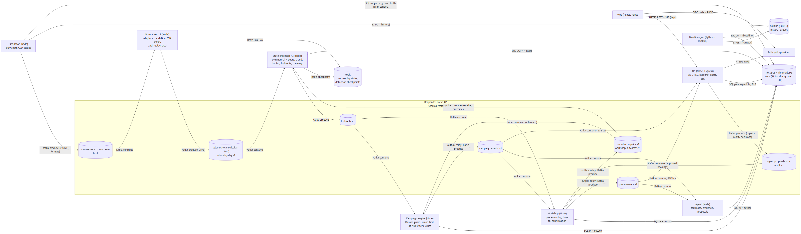

# CohortWatch

**The daily workshop queue that ranks vans by real risk, and catches shared outbreaks early.** Each van is compared
to **its own normal**, minus what its peers in the same conditions are doing. Persistent deviations become incidents
with plain-language clues; incidents that share a cause become one **campaign** (fault family × model × duty × depot).
The queue, the agent's proposals and fix confirmation turn that into tomorrow's workshop plan.



*Every service, topic and store, with protocols. More views: [diagrams](docs/diagrams/README.md) (C4 context, data
flow of one reading, sequence diagrams, ER, Kubernetes). **How well it works: [docs/evaluation.md](docs/evaluation.md)**
(every claim of brief §6 at 5K and 30K, against the baseline it must beat).*

## Quick start (5 minutes)

Requirements: **Docker Desktop with ~8 GB RAM** and nothing else. Synthetic data only (fictitious OEMs Aurex and
Kestrel).

```bash
git clone https://github.com/rsiddarth10/cohortwatch.git && cd cohortwatch
SIM_SCALE=30000 SIM_SPEED=360 AUTO_REPAIRS=on docker compose up -d   # first run builds the images (~10–15 min)
docker compose ps                                                    # all healthy; one-shot jobs "exited (0)"
```

Open **http://localhost:3000** and sign in. The first campaign opens about **5–6 minutes after `up`** (measured:
332 s on a clean clone). Sim time runs at 360×: 1 wall-second = 6 sim-minutes.

| User | Password | Role | Can |
|---|---|---|---|
| `lead` | `lead-demo` | reliability lead | everything: approve agent proposals, dismiss a campaign, record repairs, read the audit trail |
| `planner` | `planner-demo` | workshop planner | read, record repairs |
| `viewer` | `viewer-demo` | viewer | read only; no drivers, no precise locations |
| `lead2` | `lead2-demo` | lead of another tenant | sees none of tenant 1's vans (RLS) |

| What | Where |
|---|---|
| Web app | http://localhost:3000 |
| API + OpenAPI explorer | http://localhost:3100/docs (`/openapi.json`); the web app calls it through `/api` |
| Login (OIDC issuer) | http://localhost:3200 (`/.well-known/openid-configuration`) |
| Grafana (optional) | `docker compose --profile observability up -d prometheus grafana` → http://localhost:3001 |

**30K preset vs the 100K default: an honest laptop note.** With no settings, compose runs the **submission scale,
`SIM_SCALE=100000`**. On a laptop (12 CPUs, 16 GB for Docker) 100K works, but during the T0+24–42 h shift surge the
state processor falls behind: the backlog peaks at ~3.8M events, and incident latency reaches tens of minutes
(p50 ~24 min) until it drains (docs/perf/state-processor.md). **Use the 30K preset for a live demo:** through the
surge, event → incident stays under about a minute (p95 ≤ ~45 s) and the lag drains within minutes (S9 runs, Grafana). Production sizing for 100K is in [deploy/terraform/aws](deploy/terraform/aws/README.md).

### Retell the story in 5 minutes

Timings are for the 30K preset; details and exact clicks are in the [video runbook](docs/video-runbook.md). Freeze
the story at any moment with **`npm run demo:pause`** (and `demo:resume`). `npm run demo:status` lists which moments
are ready, with their URLs.

1. **Board** (~4:50, as `lead`): the depot with open campaigns comes first. A red **runaway card** ("≈ N h to
   110 °C") leads the strip; today's bays hold the outbreak vans; each card says *why* and what waiting costs.
2. **Campaign** (click the purple card): the S1 COOLING outbreak with its clues (same place, trend, firmware 4.2.1
   before onset vs healthy sisters, "15 vans where 0.3 expected"), its members and, from ~6:15, the **at-risk
   sisters** that are not faulty yet.
3. **Vehicle** (click a sister): its coolant against **its own normal band**, climbing before any incident, with
   incident (red) and repair (green) markers and its fix status.
4. **Agent & audit**: the agent proposes booking the at-risk sisters into tomorrow's bays, citing its evidence, with a
   dry-run diff. **Approve**: the board updates live ("booked by lead (approved agent proposal)"). The audit trail
   shows every view and action.
5. **Fixes and roles** (~10–14 min): repaired sisters turn **FIXED**; the bad repair turns **NOT_FIXED** and goes
   back into today's bays. Sign in as `viewer`: same board, no drivers, only a coarse area, no buttons.

## Documentation

| Topic | Where |
|---|---|
| Evaluation (claims vs baselines, 5K and 30K) | [docs/evaluation.md](docs/evaluation.md) |
| Test and quality evidence (tests, coverage, load, chaos, SAST/DAST, SBOM) | [docs/test-evidence/README.md](docs/test-evidence/README.md) |
| Performance | [docs/perf/](docs/perf/): [load](docs/perf/load.md), [chaos](docs/perf/chaos.md), [queries](docs/perf/queries.md), [workshop](docs/perf/workshop.md), [state processor](docs/perf/state-processor.md), [API](docs/perf/api.md), [bench](docs/perf/simulator-bench.md) |
| Architecture decisions (24 ADRs) | [docs/adr/README.md](docs/adr/README.md) |
| Diagrams | [docs/diagrams/README.md](docs/diagrams/README.md) |
| Threat model (STRIDE) and privacy | [docs/security/threat-model.md](docs/security/threat-model.md) · [scan reports](docs/security/reports/README.md) |
| Algorithms and SQL | [docs/algorithms-and-sql.md](docs/algorithms-and-sql.md) |
| Event streams (AsyncAPI) | [docs/asyncapi.yaml](docs/asyncapi.yaml) |
| ML at-risk classifier | [docs/ml/model-card.md](docs/ml/model-card.md) |
| Deployment (Helm, Terraform) | [deploy/helm/cohortwatch](deploy/helm/cohortwatch) · [deploy/terraform/aws](deploy/terraform/aws/README.md) |
| Video runbook | [docs/video-runbook.md](docs/video-runbook.md) |
| Brief, declarations | [docs/PROJECT_BRIEF.md](docs/PROJECT_BRIEF.md) · [docs/DECLARATIONS.md](docs/DECLARATIONS.md) |

## Tests

| Command | What | Needs |
|---|---|---|
| `npm ci && npm run lint && npm run typecheck` | ESLint + Prettier, TypeScript strict (all workspaces + web) | Node 22 |
| `npm test` | 278 unit tests + BDD, v8 coverage (`packages/domain` ≥ 80%, measured 99.3%) | Node 22 |
| `npm run test:integration` | 20 Testcontainers tests (real Redpanda, Redis, TimescaleDB) incl. API security and the Pact provider | Docker |
| `npm run test:contract` | Pact consumer contract web → API | Node 22 |
| `npm run test:e2e` | Playwright through the real login (lead approves a proposal; viewer masked) | the stack running, ~T0+30–60 h |
| `npm run eval:all` | every §6 claim vs its baseline → docs/evaluation.md | a finished run (see Commands) |
| `sh tests/load/run.sh load` · `sh tests/load/run.sh soak 600` · `sh tests/chaos/run.sh` | k6 load, soak + 50 SSE clients, chaos checks | the stack running |

## Known issues

- **100K on a laptop falls behind during the surge** (see the note above); it drains afterwards. Use the 30K preset
  for demos.
- **The at-risk moment is short.** At-risk sisters come and go every sim-hour, so a proposal can be withdrawn
  seconds after it appears. Pause with `npm run demo:pause`.
- **Restarting `auth` signs everyone out:** the local OIDC issuer generates its signing key at start, and its users
  are demo users in code (dev only; ADR 0018).
- **The e2e test is local only** (it needs the running stack). Its lead test waits up to 18 min for a pending agent
  proposal, so run it while the story is live (~T0+30–60 h).
- **The ML at-risk classifier is evaluated but not wired into the queue** (model card, *Decision*).
- **`style-src 'unsafe-inline'`** stays in the web CSP (inline chart styles); scripts are strict.
- **One stack per machine:** compose pins `name: cohortwatch` and host ports (3000, 3100, 3200, 15432, 16379,
  19092, …). Use `-p <name>` and free the ports for a second copy.
- **Docker Desktop on Windows stopped three times during long overnight runs** (a host issue). Starting it again
  resumes the stack: restarts are idempotent, and the demo clock continues where it stopped.

## Stack details

`docker compose up -d` with no settings runs 100K vans in **demo mode**. On first boot the simulator:

1. seeds the registry into Postgres with `COPY`,
2. applies the plants (brief §5.4) and writes the ground truth (`sim` schema, `data/sim-private`, never readable
   by detection),
3. writes 7 sim-days of plant-free history as Parquet to `s3://cohortwatch-lake/history/dt=…/`,
4. streams the demo at **360×**, from T0 to **T0+72 h in about 12 wall-minutes**, then keeps running.

Restarts are idempotent: the registry, plants and history are skipped when unchanged, and the demo clock resumes
where it stopped. `docker compose down -v` is the clean reset.

| What | Where |
|---|---|
| Redpanda Console (topics, live messages) | http://localhost:8080 → Topics → `raw.oem-a.v1` / `raw.oem-b.v1` |
| Lake console (RustFS) | http://localhost:19001 (user `cohortwatch`, password `cohortwatch-dev-secret`) → bucket `cohortwatch-lake` |
| Simulator metrics | http://localhost:9464/metrics (sent by topic and format, msgs/s, mess by kind, clock lag, repairs) |
| Simulator clock | http://localhost:9464/clock |
| Postgres | `localhost:15432`, db `cohortwatch` (roles `cw_sim`, `cw_app`, `cw_api`) |
| Kafka API from the host | `localhost:19092` |
| S3 API from the host | `http://localhost:19000` |

### What to look at in the Console

- **Format switch:** from T0+12 h, `raw.oem-a.v1` carries `aurex.v2` (°C, renamed fields) instead of `aurex.v1` (°F).
  Look at the `x-source-format` header.
- **Mess (on purpose):** duplicates (same VIN + seq twice), out-of-order and late messages, truncated or incomplete
  JSON, invalid VINs, unparseable fault codes, impossible values, ±90 s clock skew on 0.5% of vans.

## Viewing the data

Start the stack first (`docker compose up -d`). Everything below is local and synthetic; the passwords are
development defaults.

| What | URL / address | Login |
|---|---|---|
| **Redpanda Console**: topics, live messages, headers, consumer groups, schema registry | http://localhost:8080 | none |
| **Postgres**: registry, depots, ground truth | host `localhost`, port `15432`, database `cohortwatch` | `postgres` / `cw_postgres_dev` (admin), or `cw_app` / `cw_app_dev` (the detection role: cannot read schema `sim`) |
| **RustFS console**: the Parquet lake | http://localhost:19001 → bucket `cohortwatch-lake` → `history/` | `cohortwatch` / `cohortwatch-dev-secret` |
| **S3 API** (DuckDB, AWS CLI) | http://localhost:19000, path-style, region `us-east-1` | same keys |
| **Simulator** metrics / health / clock | http://localhost:9464/metrics · `/healthz` · `/clock` | none |
| **Normaliser** metrics / health / ledger | http://localhost:9465/metrics · `/healthz` · `/ledger` (if the port is taken on recreate, compose picks 9466–9468: `docker compose port normaliser 9465`) | none |
| **Kafka API** from the host | `localhost:19092`; schema registry `http://localhost:18081` | none |

**In the Console:** `raw.oem-a.v1` / `raw.oem-b.v1` are the messy OEM feeds, and `telemetry.canonical.v1` holds the
clean events. They are Avro, and the Console decodes them through the schema registry (subject
`telemetry.canonical.v1-value`). `telemetry.dlq.v1` holds the rejects, with `error_code`, `error_detail` and the
original payload in base64. Each canonical and DLQ record carries `x-src-topic` / `x-src-partition` /
`x-src-offset` pointing back to its raw record.

**DBeaver:** New connection → PostgreSQL → Host `localhost`, Port `15432`, Database `cohortwatch`, Username
`postgres`, Password `cw_postgres_dev` → Test Connection. Schemas `core` (the fleet) and `sim` (simulator-private
answer key).

```sql
-- 1. The fleet by model and powertrain
SELECT m.code AS model, m.powertrain, count(*) AS vans
FROM core.vehicle v JOIN core.vehicle_model m ON m.id = v.model_id
GROUP BY 1, 2 ORDER BY 3 DESC;

-- 2. Largest depots today (D-001 and D-005 hold the S1 and S1b outbreaks)
SELECT d.code AS depot, count(*) AS vans
FROM core.vehicle_depot_assignment a JOIN core.depot d ON d.id = a.depot_id
WHERE upper_inf(a.valid)
GROUP BY 1 ORDER BY 2 DESC LIMIT 10;

-- 3. What was planted (the answer key; only the postgres/cw_sim roles can read it)
SELECT scenario_id, role, count(*) AS vans, min(onset_ts) AS first_onset
FROM sim.ground_truth WHERE scenario_id IS NOT NULL
GROUP BY 1, 2 ORDER BY 1, 2;
```

**History Parquet with DuckDB** (DuckDB CLI, e.g. `winget install DuckDB.cli`):

```sql
INSTALL httpfs; LOAD httpfs;
CREATE SECRET lake (TYPE s3, KEY_ID 'cohortwatch', SECRET 'cohortwatch-dev-secret',
                    ENDPOINT 'localhost:19000', URL_STYLE 'path', USE_SSL false, REGION 'us-east-1');
SELECT count(*) AS rows, min(event_ts) AS first, max(event_ts) AS last, count(DISTINCT vin) AS vans
FROM read_parquet('s3://cohortwatch-lake/history/*/*.parquet');
```

## Scenario (brief §5.4)

| Plant | What happens |
|---|---|
| S1 outbreak | 15 vans at depot `D-001` (Kestrel Haulmark diesel, urban) drift +8…+12 °C from T0+6 h; 3 late sisters from T0+24 h; one is a bad repair |
| S1b | 8 vans of the same model/duty at `D-005` (another region), onset T0+18 h |
| Runaway | 1 Aurex linehaul van, driving continuously T0+10 h → T0+34 h, accelerating to 110 °C |
| Decoys | 6 scattered COOLING drifts at 6 depots; 2 other-model vans at `D-001` |
| Heatwave | region R3 +10 °C over T0+12 h … T0+60 h (ground truth: `scenario_id = 'heatwave'`, onset = heatwave start) |
| Also | 20 loud-but-stable vans, 3 sensor glitches, naturally-hot vans (~2% of diesel), firmware 4.2.1 rollout (16/18 sisters vs 20/42 peers) |
| Surge | T0+24 h … T0+42 h: 10-minute driving cadence (≈3× send rate) |

Every choice and timing is in `sim.scenario_manifest`. Ground truth is in `sim.ground_truth` and
`data/sim-private/ground_truth.parquet`.

> **No leaks:** detection services must never read ground truth. The database enforces it (`cw_app` has no access to
> schema `sim`), and `data/sim-private` is mounted only into the simulator (and, later, the evaluation job).

## Commands

| Command | What it does |
|---|---|
| `npm run sim:repair -- --vin <VIN>` | Publishes `{vin, repaired_at}` to `workshop.repairs.v1` at the current sim time. The van's drift stops within ~2 sim-hours, except the designated bad-repair sister. |
| `npm run sim:watch -- --vin <VIN> [--vin <VIN>]` | Follows vans on the raw topics and prints their mean driving coolant per 2 sim-hours (shows a repair working) |
| `npm run simulator:verify` | Runs the 14 checks of brief §5.8 and writes `docs/perf/verify-1b.txt` (needs the demo running for the 2-minute live sample). It runs on the host, whose config says N=5000: against the compose stack use `SIM_SCALE=100000 npm run simulator:verify`. It refuses to run if N/seed/T0 differ from what the stack was seeded with |
| `npm run sim:bench` | Stops the demo and runs bench mode: every vehicle every wall-second for 120 s, 8 workers |
| `npm run sim:bench:burst` | Bench with `--burst`: 60 s at 1×, **5 minutes at 3×**, 60 s at 1× |
| `npm run sim:reset` | Clears the demo clock, repairs and history; the next start replays from T0 |
| `npm run normaliser:reconcile [-- --seconds 300]` | Over a window, checks raw in = canonical out + DLQ + duplicates dropped (in/out/DLQ counted in Kafka via the `x-src-*` headers; duplicates from the normaliser's `/ledger`). With several replicas pass `--ledger http://localhost:9465/ledger,http://localhost:9466/ledger` |
| `npm run eval:incidents` | S3 scorecard (an evaluation tool, runs as `cw_sim`): per ground-truth role, vans flagged by the state processor vs by the simple global threshold, onset → incident hours for both, runaway hours of warning, background false incidents per 1,000 vans. Against the compose stack: `SIM_SCALE=100000 npm run eval:incidents` |
| `npm run eval:campaigns` | S5 scorecard (runs as `cw_sim`): S1 = 1 campaign, S1b separate, late sisters at-risk before their own incident (lead h), decoys/heatwave/background 0, firmware clue vs the plant, early warning, member counting. Prints the **produced horizon** first. Against the compose stack: `SIM_SCALE=<N> npm run eval:campaigns` |
| `npm run eval:workshop` | S4 + S6 scorecard (runs as `cw_sim`): queue precision@k vs loudest-first at the S1 depot and fleet-wide (point-in-time snapshot at T0+29 h, `EVAL_AT_H`), loud-but-stable vs the S1 sisters, runaway rank and critical → top (s), late sisters in the queue before their incident, fix-confirmation confusion table vs ground truth, S1 campaign close, heatwave/naturally-hot in today's bays, cards. Run with `AUTO_REPAIRS=on` to a produced horizon ≥ T0+84 h |
| **`npm run eval:all`** | **S9: every claim of brief §6 in one table → [docs/evaluation.md](docs/evaluation.md)** (claim, data, metric, ours, baseline; one column pair per N). Runs the three scorecards below plus a 60 s ingestion reconcile, saves `docs/eval/results-<N>.json`. Best practice: `npm run demo:pause` at ~T0+88 h, `EVAL_RECONCILE=off npm run eval:all`, `npm run demo:resume`, `npm run eval:all -- --reconcile-only`. `-- --render` rebuilds the page from the saved results |
| `npm run demo:pause` / `demo:resume` | Freeze / resume the simulator's clock (the whole story waits; nothing is lost). For recording the video: [docs/video-runbook.md](docs/video-runbook.md) |
| `npm run demo:status` | Sim time and which story moments are ready now (S1 open, at-risk sisters, pending proposal, runaway card, FIXED, NOT_FIXED), each with its URL |
| `docker compose --profile observability up -d prometheus grafana` | Prometheus (:9090) scraping every replica + Grafana (:3001, anonymous viewer) with the provisioned "CohortWatch pipeline" dashboard |
| `docker compose --profile ml run --rm ml-at-risk export.py /data/<file>.csv.gz` · `… train.py <train> <test> /data/out full\|signals` | S9 at-risk classifier (offline, Python 3.12, runs as `cw_sim`): export a run's van-hours, train on one seed, test on another. [Model card](docs/ml/model-card.md) |
| `sh tests/load/run.sh load\|soak [sse_seconds]` | k6 (Docker) against the API's queue + campaign endpoints; `soak` = 20 users for 10 min, optionally with 50 SSE clients. Raise `API_RATE_LIMIT_PER_MIN` for the run (one user). [docs/perf/load.md](docs/perf/load.md) |
| `sh tests/chaos/run.sh` | During a live run: restart Redis, SIGKILL a normaliser and a state-processor replica; recovery times from Prometheus, reconcile + unique counts. [docs/perf/chaos.md](docs/perf/chaos.md) |
| `npm run test:contract` | Pact consumer contract web → API (writes `pacts/`); the provider side is `services/api/src/pact.itest.ts` in `npm run test:integration` |
| `npm run campaign:dismiss -- --id <campaign id> --reason "..."` | "Not an outbreak": sticky until materially worse (+50% or +3 members, or a runaway member) |
| `npm run vehicle:normal -- --vin <VIN> [--metric coolant_c]` | One van vs its own normal, hourly (the S8 chart query: `core.telemetry_hourly` joined with the van's baseline band) |
| `npm run test:integration` | Testcontainers tests against real Redpanda + Redis (+ TimescaleDB for the state processor); needs Docker |
| `npm run history:big` | Writes 30 days at 2-minute intervals (≈ 1 billion rows at 100K) to its own prefix. Not run by default; needs a lot of disk and time. |

After a bench run, bring the demo back with `docker compose up -d simulator`.

For a completely clean demo, prefer `docker compose down -v && docker compose up -d`: from step S2 on, downstream
services remember sequence numbers, so replaying from T0 into an existing stack would look like duplicates.

### Settings (env or `.env`)

| Variable | Default | Meaning |
|---|---|---|
| `SIM_SCALE` | 100000 | vehicles (use 5000 for development: `cp .env.example .env`) |
| `SIM_WORKERS` | 4 | worker processes; output is identical for any value |
| `SIM_MODE` / `SIM_SPEED` | demo / 360 | `live` = 1× wall time |
| `PLANTS` | on | planted scenarios |
| `MESS` | on | mess injection on the raw topics |
| `AUTO_REPAIRS` | off | `on` repairs the 15 main S1 sisters (not the 3 late ones) at ~T0+30 h for unattended demos; the bad-repair sister keeps drifting |
| `DEPOT_TRANSFER` | off | `on` moves 2 S1 sisters to another depot at T0+30 h |
| `GLOBAL_COOLANT_THRESHOLD_C` / `GLOBAL_BATT_TEMP_THRESHOLD_C` | 97 / 47 | simple global thresholds: checks #10/#11, and the shadow rule the state processor runs for the evaluation baseline |
| `STATE_REPLICAS` | 3 | state-processor replicas (up to 48) |
| `CAMPAIGN_REPLICAS` / `CAMPAIGN_ALPHA` | 1 / 0.0001 | campaign-engine replicas (the relay runs on one leader); Poisson α |
| `WORKSHOP_REPLICAS` / `QUEUE_MIN_BAY_SCORE` | 1 / 0.4 | workshop replicas (relay + hourly tick on one leader); minimum score for a bay |
| `TELEMETRY` / `TELEMETRY_BUCKET_MIN` | on / 60 | telemetry writer on/off; down-sampling bucket in sim-minutes |
| `DETECT_*`, `RUNAWAY_*`, `DTC_*` | reference plan §9.3–9.5 | detection thresholds (see `services/state-processor/src/config.ts`) |
| `LAPTOP_RETENTION` / `KAFKA_PARTITION_BYTES` / `BENCH_PARTITION_BYTES` | on / 268435456 / 16777216 | disk caps on the high-volume and bench topics (see [Disk](#disk)) |
| `S3_ENDPOINT`, `S3_ACCESS_KEY_ID`, `S3_SECRET_ACCESS_KEY`, `LAKE_BUCKET` | RustFS in compose | any S3-compatible store works |
| `SIM_SEED` | cohortwatch-42 | global seed; per-VIN seed = hash(seed, VIN), identical for any worker count |
| `AGENT_ENABLED` | true | `false` keeps the agent idle; the board works without it |
| `API_RATE_LIMIT_PER_MIN` | 600 | per-user API rate limit (raise it only for load tests) |
| `OIDC_ISSUER` | http://localhost:3200 | issuer the web app signs in with and the API trusts |
| `CW_SIM_PASSWORD` / `CW_APP_PASSWORD` / `CW_API_PASSWORD` | dev defaults | database role passwords (simulator/evaluation, pipeline, API with RLS) |
| `PG_HOST_PORT` / `REDIS_HOST_PORT` | 15432 / 16379 | host ports (5432/6379 are often taken) |

### Clean reset

```bash
docker compose down -v      # removes containers AND the Postgres, Redpanda and lake volumes
rm -rf data/sim-private     # private ground truth file
docker compose up -d
```

## Reading the workshop queue

```sql
-- today's and tomorrow's bays at one depot, with the reasons (phrases) and the cost of waiting
SELECT rank, slot, vin, round(score::numeric, 2) AS score, pinned, cost_text,
       (SELECT string_agg(r->>'text', '; ') FROM jsonb_array_elements(reasons) r) AS why
FROM core.queue_item WHERE depot_id = 1 ORDER BY rank LIMIT 12;
```

- **Rank 1 with `pinned`** is a runaway: it is above every score and always gets a bay. Its card is in
  `core.alert_card`.
- **TODAY / TOMORROW** fill the depot's bays (`core.workshop_bay`, 1 slot per bay per day) in rank order. **WAITING**
  is everything else, including items under the bay threshold (0.35).
- **The reasons are the "why"**, e.g. "member of COOLING campaign at D-001 (18 vans)", "at-risk: …", "repair on
  2026-09-29 did not hold", "12 fault codes in the last 24 h". Fault codes are shown but never raise a van's rank.
- **Repairs:** `npm run sim:repair -- --vin <VIN>` (or `AUTO_REPAIRS=on`) → the van leaves the queue. After ≥ 12
  driven hours it is judged: `SELECT vin, status, text FROM core.repair`. NOT_FIXED puts it back at the top of its
  depot's queue.
- **Point-in-time queues:** `core.queue_snapshot` holds every version.

## Disk

A 100K-van demo writes about 18K msgs/s on average to the raw topics (measured: ~80 B per message on disk after zstd,
≈ 5 GB/hour uncapped), so Kafka is capped by default (`LAPTOP_RETENTION=on`):

- **Raw and canonical topics:** 6 h **and** at most `KAFKA_PARTITION_BYTES` (default **256 MiB**) per partition, in
  16 MiB segments (closed after 10 min if idle). At demo rate one raw partition holds about **2.4 wall-hours**
  (measured ~384 msgs/s × ~80 B per partition). A consumer stopped for longer loses the oldest data: fine for local
  dev, not for production (`LAPTOP_RETENTION=off` = the brief's 3 days).
- **Bench topics** (`bench.raw.v1`, `bench.canonical.v1`): 10 min and `BENCH_PARTITION_BYTES` (16 MiB) per
  partition in every mode; bench measures throughput and keeps nothing. The simulator also clears `bench.raw.v1`
  after a run (Redpanda frees the files within ~20 min).
- Redpanda preallocates 1 MiB per partition instead of 32 MiB in laptop mode (≈ 6.4 GB of empty files otherwise).
- **Worst case:** (cap + one segment) × partitions = 272 MiB × 48 ≈ **12.8 GiB** for the raw topics, ≈ **25.5 GiB**
  once `telemetry.canonical.v1` fills (S2), plus ≤ 3 GiB of bench topics during a bench run.
- **Where it lives:** on the dev machine Docker Desktop's data disk is on `D:\DockerData` (Settings → Resources →
  Advanced → Disk image location). On a small disk set `KAFKA_PARTITION_BYTES=67108864` (64 MiB → ≈ 3.8 GiB raw).
- Develop at `SIM_SCALE=5000`; run 100K for done-checks, then `docker compose stop`.
- Don't run `npm run history:big` on a laptop (≈1B rows, 20–30 GB in the lake).
- Change the caps: set the env vars (or `.env`), then `docker compose run --rm topic-init` (applies to existing topics;
  a new segment size takes effect from the next segment).

## What runs

| Service | Image | Role |
|---|---|---|
| `redpanda` | `redpandadata/redpanda:v24.2.7` | Kafka API + schema registry |
| `redpanda-console` | `redpandadata/console:v2.7.2` | Topic browser |
| `postgres` | `timescale/timescaledb-ha:pg16.15-ts2.30.1` | Relational core (3NF) + TimescaleDB + pgvector |
| `redis` | `redis/redis-stack-server:7.4.0-v1` | Hot state (used from S2) |
| `rustfs` | `rustfs/rustfs:1.0.0` | S3-compatible lake (MinIO's public images were withdrawn) |
| `topic-init` / `db-migrate` / `lake-init` | redpanda / postgres / `amazon/aws-cli:2.37.4` | One-shot: topics, migrations, lake bucket |
| `simulator` | built from `services/simulator/Dockerfile` | Seeds, plants, history, demo stream |
| `sim-history` | simulator image, one-shot | Seeds, plants, writes the 7-day history (van traits, no faults) to the lake, exits. Idempotent |
| `baselines` | built from `batch/baselines/Dockerfile` (Python 3.12 + DuckDB) | S3 batch analytics, one-shot: each van's normal (median/MAD of level and slope), model × duty × region cohorts, usual code rates, fault-rate table → Postgres. Skipped when the history was already processed |
| `normaliser` | built from `services/normaliser/Dockerfile` | S2: raw OEM feeds → validated, de-duplicated canonical events (Avro) + DLQ. Stateless (per-VIN state in Redis). **3 replicas by default**; `NORMALISER_REPLICAS=N docker compose up -d normaliser` scales it, up to 48 (the input partition count). Measured: [docs/perf/normaliser.md](docs/perf/normaliser.md). |
| `state-processor` | built from `services/state-processor/Dockerfile` | S3: canonical events → each van vs its own normal, minus its peers, confirmed 4 of 6 → incidents with plain-language clues (`incidents.v1`, key = family key, and `core.incident`); runaway = critical; down-sampled telemetry (`core.telemetry` hypertable + hourly aggregate). Per-VIN state in memory per partition, checkpointed to Redis (ADR 0005). **3 replicas by default** (`STATE_REPLICAS`). Measured: [docs/perf/state-processor.md](docs/perf/state-processor.md). |
| `campaign-engine` | built from `services/campaign-engine/Dockerfile` | S5: `incidents.v1` → campaigns per family key (Poisson guard with a regional expected rate, join once, union-find), at-risk sisters, clues (firmware, trend, codes, region, cost), similar past campaigns (pgvector); transactional outbox → `campaign.events.v1`. 1 replica by default. Measured: [docs/perf/campaign-engine.md](docs/perf/campaign-engine.md). |
| `workshop` | built from `services/workshop/Dockerfile` | S4 + S6: the daily queue per depot (ranked, bays today/tomorrow, reasons, cost of waiting; `core.queue_item` + versioned snapshots → `queue.events.v1`), runaway and campaign cards (`core.alert_card`), repairs from `workshop.repairs.v1` judged on post-repair driven hours (FIXED / NOT_FIXED / PENDING → `workshop.outcomes.v1`). Measured: [docs/perf/workshop.md](docs/perf/workshop.md). |

## Measured (step 1b)

See [docs/perf/verify-1b.txt](docs/perf/verify-1b.txt) and [docs/perf/simulator-bench.md](docs/perf/simulator-bench.md).

## Develop

```bash
npm install
npm run lint        # ESLint + Prettier
npm run typecheck   # tsc -b (strict)
npm test            # Vitest + coverage (packages/domain must stay >= 80%)
```

Repository layout and rules: [CLAUDE.md](CLAUDE.md). Open-source and AI declarations: [docs/DECLARATIONS.md](docs/DECLARATIONS.md).

## Data

All data is synthetic. The OEMs ("Aurex", "Kestrel"), their VIN manufacturer codes, tenants, depots, regions and
coordinates are fictitious. Drivers exist only as pseudonyms.
